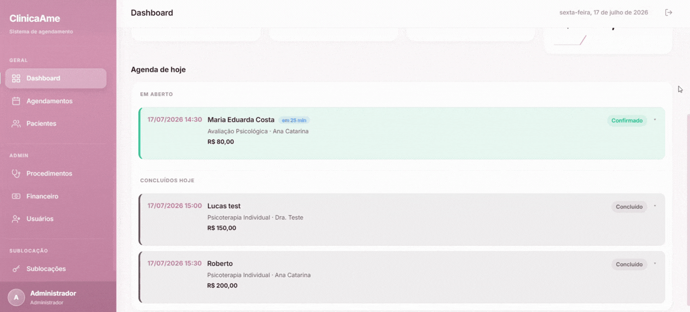
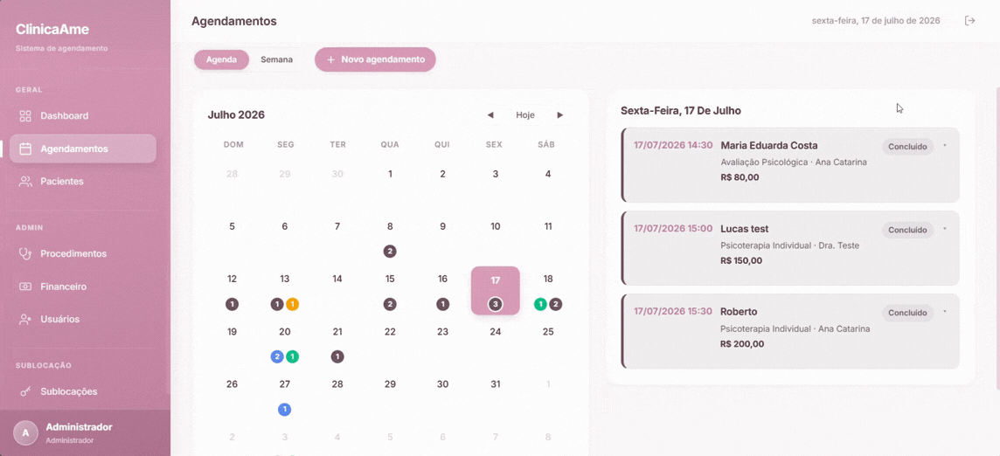
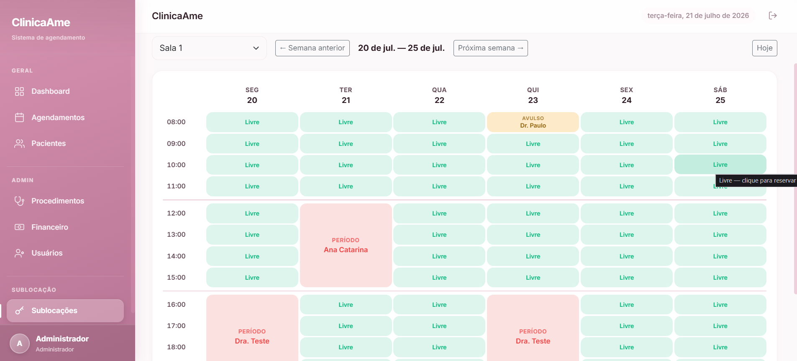

# ClinicaAme

Sistema de agendamento para clínicas de psicologia (psicólogos, psicopedagogos e outros profissionais). Administradores e profissionais gerenciam pacientes, agendamentos (incluindo sessões recorrentes), procedimentos/serviços e o financeiro da clínica.

## O que o sistema faz

- **Agendamentos** — visão em Agenda (lista) ou em Semana (calendário estilo Google Calendar), criação de sessão única ou recorrente (semanal/quinzenal), preço definido por agendamento (independente do procedimento), checagem de disponibilidade em tempo real, confirmar/concluir/cancelar/marcar falta, histórico de alterações e exclusão (admin).
- **Pacientes e Usuários** — cadastro de pacientes, profissionais e administradores; ativar/desativar; redefinir senha; validação de e-mail duplicado em tempo real.
- **Procedimentos** — catálogo de serviços com duração e categoria (o preço é definido por agendamento, não fixo no procedimento).
- **Sublocação de salas** — aluguel de salas da clínica para terceiros: reservas avulsas (hora avulsa) ou recorrentes (período fixo semanal, com fatura antecipada), faturamento mensal automático e controle de pagamento.
- **Financeiro** — resumo do mês, pagamentos pendentes, registro de pagamento, gráficos financeiros.
- **Dashboard** — aniversariantes do mês, indicadores rápidos.
- **E-mail** — o paciente recebe um e-mail (via Resend) quando o agendamento é criado e quando é confirmado.

## Capturas de tela

### Dashboard


### Financeiro


### Agendamentos


### Sublocação


## Estrutura do repositório

```
backend/     API em PHP puro (sem framework) + MySQL — ver backend/README.md
frontend/    SPA em React + Vite — ver frontend/README.md
```

Cada pasta tem seu próprio README com detalhes técnicos (endpoints da API, variáveis de ambiente, arquitetura do frontend, como rodar).

## Rodando o projeto localmente

Precisa dos dois lados rodando ao mesmo tempo — o frontend consome a API do backend.

```bash
# Backend (porta 8000)
cd backend
composer install
mysql -u root -p < database/schema2.sql
php -S localhost:8000 -t public

# Frontend (porta 5173), em outro terminal
cd frontend
npm install
npm run dev
```

Depois é só abrir `http://localhost:5173`. Detalhes de configuração (`.env`, variáveis obrigatórias) estão em [`backend/README.md`](backend/README.md) e [`frontend/README.md`](frontend/README.md).

## Stack

| | |
|---|---|
| Backend | PHP 8.2+, MySQL, JWT (autenticação), Resend (e-mail) |
| Frontend | React 19, Vite, React Router, React Bootstrap |
